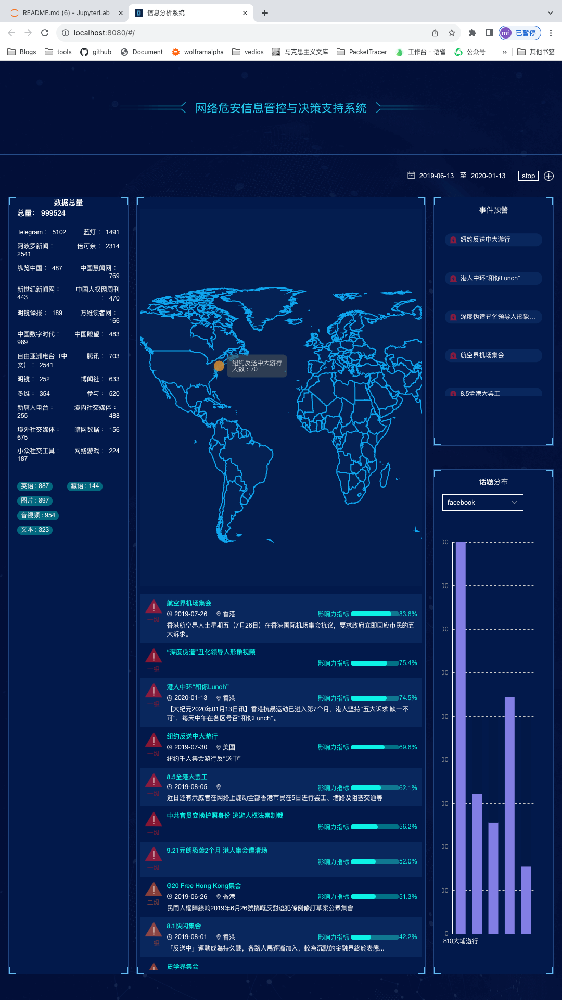

# 工作总览

# 工作进度表

| 工作项目           | 内容                                                 | 完成度     | 备注                                       |
| ------------------ | ---------------------------------------------------- | ---------- | ------------------------------------------ |
| 爬虫工具构建       | 确定接口格式，构建统一接口                           | finish     |                                            |
|                    | 编写爬虫工具，选取某一平台进行数据爬取               | processing | 爬取内容：文本内容，发帖对象，发帖时间？？ |
| 数据清洗           | 建立数据库                                           |            |                                            |
|                    | 对接爬虫工具和数据库，进行数据入库工作               |            |                                            |
| 指标构建与后端开发 | 基于爬取的时间信息构建**时间敏感性计算方法**         |            |                                            |
|                    | 基于敏感词表构建**内容敏感性计算方法**               |            |                                            |
|                    | 基于贴文相关数据（比如点赞）构建**内容热度计算方法** |            |                                            |
|                    | 基于贴文相关数据构建**自媒体趋势评分计算方法**       |            |                                            |
|                    | 基于已有指标拟合**总评分**                           |            |                                            |
|                    | 结合社交机器人识别统一化评分计算接口                 |            | 从而方便前端调用                           |
| 前端开发           | 开发相应前端数据可视化页面等                         |            |                                            |
| 编写项目报告书     | 包括理论分析，实验结果，项目说明书等内容             |            |                                            |

# old version social radar

in file **social-radar(version 0.1)** run command:``npm run dev``

效果图：

